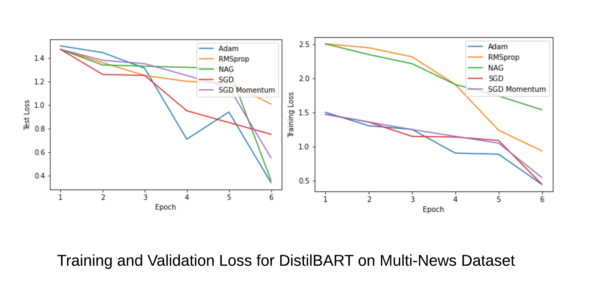
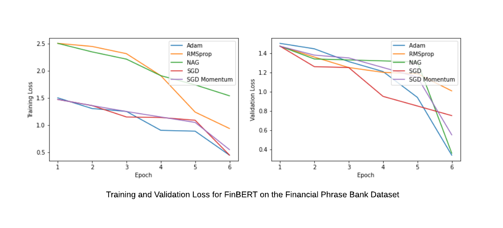
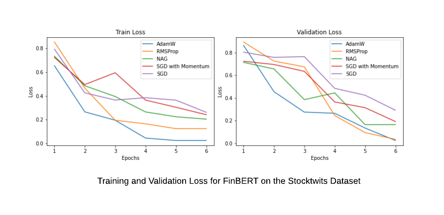
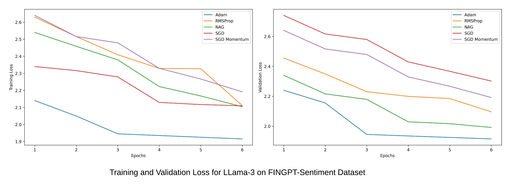
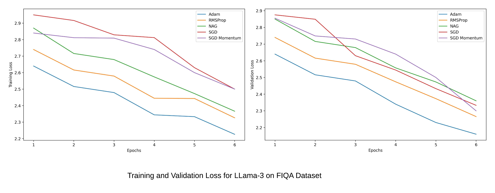
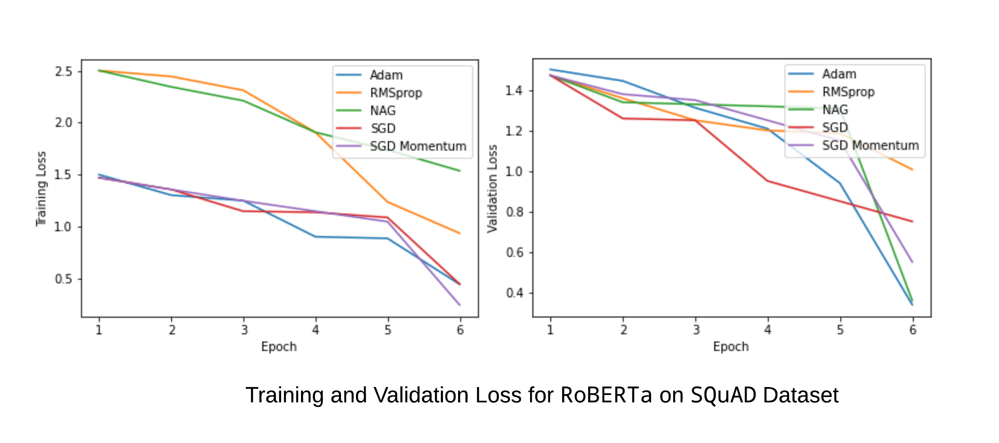
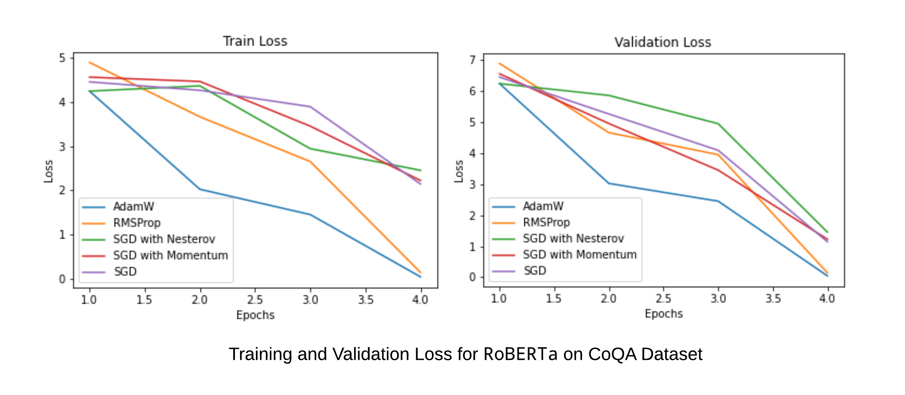

# Effect of Optimizer Selection and Hyperparameter Tuning on Training Efficiency and LLM Performance

**Paper:** [Optimizer Inclusions](paper/optimizer_inclusions.pdf)

- The choice of optimization algorithm for training Large Language Models (LLMs) significantly impacts both training speed and final predictive performance. We demonstrate the critical importance of hyperparameter tuning protocols in optimizer comparisons for LLMs. Our work reveals that inclusion relationships between optimizers play a crucial role in practice and consistently predict optimizer performance.

- Contrary to conventional wisdom, we find that when carefully tuned, adaptive gradient methods such as Adam never underperform simpler optimizers like momentum or stochastic gradient descent (SGD). Our experiments show that more general optimizers consistently outperform their special cases, highlighting the practical significance of inclusion relationships between optimizers.

- We illustrate the sensitivity of optimizer comparisons to hyperparameter tuning protocols by examining previous experimental evaluations. Our results demonstrate how changes in tuning protocols can significantly alter optimizer rankings for a given workload (model and dataset pair). Notably, as more effort is invested in tuning, optimizer rankings stabilize according to their inclusion relationships.

- To validate our findings, we conducted extensive hyperparameter tuning across three NLP tasks: Sentiment Analysis, Question Answering, and Text Summarization. We utilized well-known foundational language models and fine-tuned them on various datasets for each task. For Sentiment Analysis, we used Financial Phrasebank, StockTwits, and FinGPT-Sentiment datasets. Question Answering experiments were conducted on SQuAD, CoQA, and FIQA datasets, while Summarization tasks employed Multi-News and BillSum datasets.

- We fine-tuned DistilBERT, BERT, and FinBERT models for Sentiment Analysis on the StockTwits and Financial PhraseBank dataset, while DistilBERT, BERT, RoBERTa were fine-tuned for Question Answering on the CoQA and SQuAD dataset. For Text Summarization, BART, DistillBART, and T5 models were fine-tuned on the BillSum and Multi-News dataset.

- Using these fine-tuned models, we demonstrate the inclusion relationships for a range of optimizers, including Adam, RMSProp, Nesterov Accelerated Gradient (NAG), SGD with momentum, and vanilla SGD. Our findings underscore that the differences between optimizers are entirely captured by their update rules and hyperparameters, with more expressive optimizers consistently outperforming their less expressive counterparts as hyperparameter tuning approaches optimality.

- The difference between optimizers is entirely captured by the choice of update rule and hyperparameters. As a hyperparameter tuning protocol approaches optimality, a more expressive optimizer can never underperform any of its specializations.

- In our experiments, we chose the search space for each optimizer by running an initial set of experiments over a relatively large search space. In a typical case, we ran a single set of initial trials per optimizer to select the final search space.

- Inclusion relationships between optimizers are very important in practice. More general optimizers never underperform their special cases. In particular, RMSProp and AdamW never underperformed SGD, Nesterov, or Momentum optimizers.

## Parameters used in Hyperparameter Tuning

- The **Learning Rate (η)** controls how much to change the model in response to the estimated error each time the model weights are updated. Choosing the learning rate is challenging since a value too small may result in a long training process that could get stuck, whereas a value too large may result in learning a sub-optimal set of weights too quickly or an unstable training process.

- The **Momentum (γ)** allows the gradient search to build inertia in a direction in the search space, and overcome the oscillations of noisy gradients and converge to the local maxima/minima faster. Momentum has the effect of dampening down the change in the gradient and the step size with each new point in the search space.

- The **Smoothing Constant (α)** maintains a decaying average of squared gradients. Using a decaying moving average of the partial derivative allows the search to forget early partial derivative values and focus on the most recently seen shape of the search space.

- **The Exponential Decay Rate Moment Estimates (β1 and β2)** are used for smoothing the path to convergence, and for also providing some momentum to cross a local minima or saddle point.

- The difference between optimizers is entirely captured by the choice of update rule and hyperparameters. As a hyperparameter tuning protocol approaches optimality, a more expressive optimizer can never underperform any of its specializations. This can be shown by the inclusion relations between the optimizers as follows:

  - SGD ⊆ MOMENTUM ⊆ RMSPROP
  - SGD ⊆ MOMENTUM ⊆ ADAM
  - SGD ⊆ NESTEROV ⊆ NADAM

## Data

### Financial Phrase Bank  

The Financial PhraseBank dataset consists of 4840 sentences from English language financial news categorised by sentiment.
These sentences then were annotated by 16 people with background in finance and business. The dataset contains two columns:

- **Sentiment**: The sentiment can be negative, neutral or positive.
- **News Headline**: Headlines of the news articles. Predicting the sentiment based on the news headlines.

For the Financial PhraseBank dataset, a baseline was set using the BERT model. The BERT model was fine-tuned using an AdamW optimizer with learning rate of 5e-5, and a batch-size of 32. The performance of the model was evaluated on the basis of the Accuracy and F1-Score(Weighted) on the test set. The FinBERT model achieved the best performance on the Financial PhraseBank dataset.

### StockTwits

The Stocktwits dataset consists of 64,51,067 StockTwits from the [StockTwits](https://stocktwits.com/) platform and each post has been categorised by a polarity. The dataset contains two columns:

- **Text**: The text contained in the StockTwit post. The text refers to information about the performance of a stock.
- **Polarity**: Contains two values ie. Negative and Positive. Negative indicates that the Stock price may from fall whereas Positive indicates an increase in price of the Stock.

For the StockTwits dataset, a baseline was set using the BERT model. The BERT model was fine-tuned using an AdamW optimizer with learning rate of 5e-5, and a batch-size of 32. The DistilBERT and FinBERT models were fine-tuned using an AdamW optimizer with learning rate of 3e-5 and a batch-size of 32. The performance of the model was evaluated on the basis of the Accuracy and F1-Score(Weighted) on the test set. The FinBERT model achieved the best performance on the StockTwits dataset.

### FINGPT-Sentiment

The FinGPT-Sentiment dataset is a combination of the Financial Phrase Bank, FIQA-sentiment, twitter-financial-news-sentiment and news-with-gpt-instructions datasets. The dataset consists of:

- **Input:** The text contained in the Headline of the news articles.
- **Instruction:** This column provides specific instructions or prompts that guide the sentiment analysis task. The instructions instruct the model to evaluate the sentiment of the text in the input column and specify the possible sentiment categories to choose from.
- **Output:** Contains sentiment labels which can be positive, negative, neutral, and fine-grained categories such as mildly positive, mildly negative, moderately positive, and moderately negative.

The Llama-3 model was fine-tuned using an AdamW optimizer with learning rate of 3e-5, and a batch-size of 16 on the FinGPT-Sentiment dataset. The performance of the model was evaluated on the basis of F1-Score(Weighted) on the test set. The Llama-3 model achieved the best performance on the FinGPT-Sentiment dataset.

The Llama-3 model was fine-tuned using an AdamW optimizer with learning rate of 3e-5, and a batch-size of 16 on the FinGPT-Sentiment dataset. The Phi-3 model was also fine-tuned using an AdamW optimizer with learning rate of 3e-5 and a batch-size of 16. The models were trained for 6 epochs each The performance of the model was evaluated on the basis of F1-Score(Weighted) on the test set. The Llama-3 model achieved the best performance on the FinGPT-Sentiment dataset.  

### FIQA

The Financial Opinion Mining and Question Answering (FIQA) dataset is a compilation of questions and answers from financial domain texts such as micro-blogging messages, news statements or headlines. The dataset contains roughly 6,000 questions and 57,000 answers. The dataset consists of:

- **Titles**: The Title for the Financial article.
- **Text**: The description of the Financial article.

The Llama-3 model was fine-tuned using an AdamW optimizer with learning rate of 3e-5, and a batch-size of 16 on the FIQA dataset. The Phi-3 model was also fine-tuned using an AdamW optimizer with learning rate of 3e-5 and a batch-size of 16. The models were trained for 6 epochs each. The performance of the model was evaluated on the basis of F1-Score(Weighted) on the test set. The Llama-3 model achieved the best performance on the FIQA dataset.

### Conversation QA Dataset (CoQA)

CoQA is a large-scale dataset for building Conversational Question Answering systems. The goal of the CoQA challenge is to measure the ability of machines to understand a text passage and answer a series of interconnected questions that appear in a conversation.

CoQA contains 127,000+ questions with answers collected from 8000+ conversations. Each conversation is collected by pairing two crowdworkers to chat about a passage in the form of questions and answers.

For the CoQA dataset, a baseline was set using the BERT model. The BERT model was fine-tuned using an AdamW optimizer with learning rate of 5e-5, and a batch-size of 16. The DistilBERT and RoBERTa models were also fine-tuned using an AdamW optimizer with learning rate of 3e-5 and a batch-size of 16.  The performance of the model was evaluated on the basis of F1-Score(Weighted) on the test set. The RoBERTa model achieved the best performance on the CoQA dataset.

### SQuAD

The Stanford Question Answering Dataset (**SQuAD**) is a reading comprehension dataset consisting of questions posed by crowdworkers on a set of Wikipedia articles. The answer to every question is a segment of text, or span, from the corresponding reading passage. There are 100,000+ question-answer pairs on 500+ articles. The dataset consists of:

- **Title**: The Title for each question and answer pair.
- **Context**: The context of the news article.
- **Question**: The question regarding the context.
- **Answers**: The answer to each question.

For the SQuAD dataset, a baseline was set using the BERT model. The BERT model was fine-tuned using an AdamW optimizer with learning rate of 5e-5, and a batch-size of 32. The DistilBERT and RoBERTa models were also fine-tuned using an AdamW optimizer with learning rate of 5e-5 and a batch-size of 32.The performance of the model was evaluated on the basis of F1-Score(Weighted) on the test set. The RoBERTa model achieved the best performance on the SQuAD dataset.

### BillSum

BillSum is the first dataset for summarization of US Congressional and California state bills.

The BillSum dataset consists of three parts: US training bills, US test bills and California test bills. The US bills were collected from the Govinfo service provided by the United States Government Publishing Office (GPO). The corpus consists of bills from the 103rd-115th (1993-2018) sessions of Congress. The data was split into 18,949 train bills and 3,269 test bills. For California, bills from the 2015-2016 session were scraped directly from the legislature’s website; the summaries were written by their Legislative Counsel. The dataset consists of:

- **Text:** Text present in the congressional or state bills.
- **Summary:** Summary of the Bills.

For the BillSum dataset, a baseline was set using the BART model. The BART model was fine-tuned using an AdamW optimizer with learning rate of 2e-5, and a batch-size of 8. The DistilBART and T5 models were also fine-tuned using an AdamW optimizer with learning rate of 2e-5 and a batch-size of 8. The performance of the model was evaluated on the basis of the ROUGE-1, ROUGE-2 and ROUGE-L scores on the test set. The DistilBART model achieved the best performance on the BillSum dataset.

### Multi News

Multi-News, consists of news articles and human-written summaries of these articles from the site newser.com. Each summary is professionally written by editors and includes links to the original articles cited.

There are two features:

- Document: Text of News Articles
- Summary: News Summary.

For the Multi-News dataset, a baseline was set using the BART model. The BART model was fine-tuned using an AdamW optimizer with learning rate of 2e-5, and a batch-size of 32. The DistilBART model was also fine-tuned using an AdamW optimizer with learning rate of 2e-5 and a batch-size of 32. The performance of the model was evaluated on the basis of the ROUGE-1, ROUGE-2 and ROUGE-L scores on the test set. The DistilBART model achieved the best performance on the Multi-News dataset.

## Experiments

### Financial Phrase-Bank

- The FINBERT model was fine tuned on the data. Training the model with an **Adam optimizer** with learning rate of 5e-5, for **3 epochs** yielded an **Accuracy of 90.91% and an F1 Score of 0.91.**

| Model      | Epochs | Accuracy | F1 Score(Weighted) |
| ---------- | ------ | -------- | ------------------ |
| FinBERT    | 3      | 90.9%    | 0.91               |
| BERT       | 3      | 86%      | 0.86               |
| DistilBERT | 3      | 82%      | 0.81               |

Hyperparameters used:

| Optimizer     | Learning Rate $\gamma$ | Momentum $\eta$ | Alpha $\alpha$ | Beta1 $\beta_1$ | Beta2 $\beta_2$ | Epsilon $\epsilon$ |
| ------------- | ---------------------- | --------------- | -------------- | --------------- | --------------- | ------------------ |
| AdamW         | 5e-5                   | 0.01            | 0.9            | 0.9             | 0.999           | 1e-5               |
| RMSprop       | 0.01                   | 0.01            | 0.99           | -               | -               | 1e-5               |
| NAG           | 5e-5                   | -               | -              | -               | -               | -                  |
| SGD(Momentum) | 5e-5                   | 0.001           | -              | -               | -               | -                  |
| SGD           | 0.01                   | -               | -              | -               | -               | -                  |

### StockTwits

- For the **StockTwits** dataset, the best results were obtained using a fine-tuned **FinBERT** model. The model was trained using the **Adam** optimizer with learning rate of 5e-5, for **6 epochs** yielding an **Accuracy of 82%** and an **F1-Score of 0.68**.

| Model      | Accuracy | F1 Score(Weighted) |
| ---------- | -------- | ------------------ |
| RoBERTa    | 0.67     | 0.46               |
| DistilBERT | 0.74     | 0.52               |
| FinBERT    | 0.82     | 0.68               |

The comparison of the optimizer hyperparameters that were taken are shown below:

| Optimizer     | $\gamma$ (Learning Rate) | $\eta$ Momentum | $\alpha$ Alpha | $\beta_1$ Beta1 | $\beta_2$ Beta2 | $\epsilon$ Epsilon |
| ------------- | ------------------------ | --------------- | -------------- | --------------- | --------------- | ------------------ |
| AdamW         | 3e-5                     | 0.01            | 0.99           | 0.9             | 0.999           | 1e-5               |
| RMSprop       | 0.01                     | 0.01            | 0.99           | -               | -               | -                  |
| Adagrad       | 3e-5                     |                 | -              | -               | -               | -                  |
| SGD(Momentum) | 3e-5                     | 0.001           | -              | -               | -               | -                  |
| SGD           | 0.01                     |                 | -              | -               | -               | -                  |

### FINGPT-Sentiment

#### **LLama 3**

- The LLama 3 model was fine tuned on the data. Training the model with an **Adam optimizer** with learning rate of 3e-5, for **6 epochs** yielded an **Accuracy of 84% and an F1 Score of 0.68.**

**Hyperparameter Tuning**

| Model       | Accuracy | F1 Score(Weighted) |
| ----------  | -------- | ------------------ |
| LLama 3     | 0.84     | 0.68               |
| Phi 3       | 0.74     | 0.59               |

## Optimizers Comparison

The comparison of the optimizer hyperparameters that were taken are shown below:

| Optimizer        | $\gamma$ (Learning Rate) | $\eta$ Momentum  |$\alpha$ Alpha | $\beta_1$ Beta1 | $\beta_2$ Beta2 | $\epsilon$ Epsilon |
|------------------|-------------------|--------------|-----------|------------|------------|-------------|
| SGD              | 0.01              | -            | -         | -          | -          | -           |
| SGD (Momentum)   | 1e-2              | 1e-3         | -         | -          | -          | -           |
| NAG              | 1e-3              | 1e-3         | -         | -          | -          | -           |
| RMSProp          | 2e-5              | 1e-1         | 0.99      | -          | -          | 1e-5        |
| AdamW            | 3e-5              | 1e-1         | -         | 0.99       | 0.99       | 1e-5        |

## FIQA

#### **LLama 3**

- Training the model with an AdamW optimizer with learning rate of 3e-5 for 6 epochs on the Llama-3 model, yielded an **F1 Score of 0.86**.

**Hyperparameter Tuning**

| Model      | F1 Score(Weighted) |
| ---------- | ------------------ |
| LLama 3    | 0.86               |
| Phi 3      | 0.75               |

## Optimizers Comparison

The comparison of the optimizer hyperparameters that were taken are shown below:

| Optimizer        | $\gamma$ (Learning Rate) | $\eta$ Momentum | $\alpha$ Alpha | $\beta_1$ Beta1 | $\beta_2$ Beta2 | $\epsilon$ Epsilon |
|------------------|-------------------|--------------|-----------|------------|------------|-------------|
| SGD              | 0.01              | -            | -         | -          | -          | -           |
| SGD (Momentum)   | 1e-2              | 1e-3         | -         | -          | -          | -           |
| NAG              | 1e-3              | 1e-3         | -         | -          | -          | -           |
| RMSProp          | 3e-5              | 1e-1         | 0.99      | -          | -          | 1e-5        |
| AdamW            | 2e-5              | 1e-1         | 0.99      | 0.99       | 0.99       | 1e-5        |

## COQA

#### **DistilBERT**

- Training the model with an AdamW optimizer with learning rate of 5e-5 for 4 epochs, yielded an **F1 Score of 0.68**.

**Hyperparameter Tuning**

| Model      | F1 Score(Weighted) |
| ---------- | ------------------ |
| DistilBERT | 0.68               |
| BERT       | 0.72               |
| RoBERTa    | 0.84               |

## Optimizers Comparison

The comparison of the optimizer hyperparameters that were taken are shown below:

| Optimizer        | $\gamma$ (Learning Rate) | $\eta$ Momentum | $\alpha$ Alpha |$\beta_1$ Beta1 | $\beta_2$ Beta2 | $\epsilon$ Epsilon |
|------------------|-------------------|--------------|-----------|------------|------------|-------------|
| SGD              | 0.01              | -            | -         | -          | -          | -           |
| SGD (Momentum)   | 1e-2              | 1e-3         | -         | -          | -          | -           |
| NAG              | 1e-3              | 1e-3         | -         | -          | -          | -           |
| RMSProp          | 2e-5              | 1e-1         | 1-1e-2    | -          | -          | 1e-5        |
| AdamW            | 3e-5              | 1e-1         | 1-1e-2    | 1-1e-2     | 1-1e-2     | 1e-5        |

## SQUAD

- The RoBERTa model was fine tuned on the data. Training the model with an **Adam optimizer** with learning rate of **5e-5**, for **6 epochs** yielded an **Exact Match(EM)** of 72% and an **F1 Score** of **74**.

**Hyperparameter Tuning**

| Model      | Epochs | Exact Match(EM) | F1 Score(Weighted) |
| ---------- | ------ | --------------- | ------------------ |
| BERT       | 6      | 68              | 64                 |
| DistilBERT | 6      | 70              | 62                 |
| RoBERTa    | 6      | 72              | 74                 |

## Optimizers Comparison

The table lists out the different optimizers and their parameters used in training.

| Optimizer     | Learning Rate $\gamma$ | Momentum $\eta$ | Alpha $\alpha$ | Beta1 $\beta_1$ | Beta2 $\beta_2$ | Epsilon $\epsilon$ |
| ------------- | ---------------------- | --------------- | -------------- | --------------- | --------------- | ------------------ |
| AdamW         | 5e-5                   | 0.01            | 0.9            | 0.9             | 0.999           | 1e-5               |
| RMSprop       | 0.01                   | 0.01            | 0.99           | -               | -               | 1e-5               |
| NAG           | 5e-5                   |                 | 0.01           | -               | -               | -                  |
| SGD(Momentum) | 5e-5                   | 0.001           | -              | -               | -               | 1e-5               |
| SGD           | 0.01                   |                 |                |                 |                 |                    |

## BillSum

**Hyperparameter Tuning**

- The DistilBART model was fine tuned on the data. Training the model with an **Adam optimizer** with learning rate of **3e-5**, for **6 epochs** yielded an **ROUGE-L** of 25.

| Model      | ROUGE-1 | ROUGE-2 | ROUGE-L |
| ---------- | ------- | -------- | -------- |
| T5         | 38      | 12       | 22       |
| DistilBART | 40      | 17       | 25       |

## Optimizers Comparison

The table lists out the different optimizers and their parameters used in training.

| Optimizer | (Learning Rate) | (Momentum) | (Alpha) | (Betal) | (Beta2) | (Epsilon) |
|---|---|---|---|---|---|---|
| SGD | 0.01 | - | - | - | - | - |
| SGD(Momentum) |  -| 1e-2 | 1e-3 | - | - | - |
| NAG | 1e-3 | 1e-3 | - | - | - | - |
| RMSProp | 2e-5 | 1e-1 | 1-1e-2 | 1e-5 | - |
| AdamW | 3e-5 | 1e-1 | 1-1e-2 | 1-1e-2 | 1e-5 |

## Multi News

**Hyperparameter Tuning**

The DistilBART model for text summarization was trained with **Adam optimizer** having learning rate **2e-5** for **6 epochs** yielded a ROUGE-L score of 42 and F1(weighted) of 0.86.

| Model      | Epochs | ROUGE-L | F1 Score(Weighted) |
| ---------- | ------ | -------- | ------------------ |
| BART       | 6      | 38       | 0.84               |
| DistilBART | 6      | 42       | 0.86               |

## Optimizers Comparison

The table lists out the different optimizers and their parameters used in training.

| Optimizer     | Learning Rate $\gamma$ | Momentum $\eta$ | Alpha $\alpha$ | Beta1 $\beta_1$ | Beta2 $\beta_2$ | Epsilon $\epsilon$ |
| ------------- | ---------------------- | --------------- | -------------- | --------------- | --------------- | ------------------ |
| AdamW         | 5e-5                   | 0.01            | 0.9            | 0.9             | 0.999           | 1e-5               |
| RMSprop       | 0.01                   | 0.01            | 0.99           | -               | -               | -                  |
| NAG           | 5e-5                   |                 | -              | -               | -               | -                  |
| SGD(Momentum) | 5e-5                   | 0.001           | -              | -               | -               | -                  |
| SGD           | 0.01                   |                 | -              | -               | -               | -                  |

## Training and validation loss for the Fine-tuned models

Comparing the Training and Validation loss of all optimizers for the fine tuned DistilBART model on the Multi- News Dataset

Comparing the Training and Validation loss of all optimizers for the fine tuned FinBERT model on the Financial Phrase Bank Dataset

Comparing the Training and Validation loss of all optimizers for the fine tuned FinBERT model on the Stocktwits Dataset

Comparing the Training and Validation loss of all optimizers for the fine tuned LLama-3 model

Comparing the Training and Validation loss of all optimizers for the fine tuned LLama-3 model

Comparing the Training and Validation loss of all optimizers for the fine tuned RoBERTa model

Comparing the Training and Validation loss of all optimizers for the fine tuned RoBERTa model

Comparing the Training and Validation loss of all optimizers for the fine tuned DistilBART model.

## GPT-3 Training Details

1. Optimization and Learning Rate Strategy
    - The Adam optimizer was used with parameters:  
      - $\beta_1 = 0.9$, $\beta_2 = 0.95$, and $\epsilon = 10^{-8}$.  
      - Gradient clipping was applied with a global norm limit of 1.0.  
    - Learning rate schedule:  
      - A cosine decay was applied, reducing the learning rate to 10% of its initial value over 260 billion tokens.  
      - After 260 billion tokens, training continued at 10% of the original learning rate.  
      - A linear warmup phase was implemented for the first 375 million tokens.  

2. Batch Size and Data Sampling
    - Batch size gradually increased from 32k tokens to its full value over the first 4–12 billion tokens of training.  
    - Data was sampled without replacement until an epoch boundary was reached, minimizing overfitting.  
    - Weight decay of 0.1 was applied to provide regularization.

3. Sequence Handling
    - Training utilized the full context window of `nctx = 2048` tokens.  
    - Multiple shorter documents were packed into a single sequence when their combined length was less than 2048 tokens to maximize computational efficiency.  
    - Sequences with multiple documents were not masked but were separated by a special end-of-text token, enabling the model to recognize unrelated contexts.

4. Mixed Precision and Gradient Accumulation
    - Mixed precision training was employed, combining 16-bit and 32-bit floating-point types to reduce memory usage and increase training speed.  
    - Gradient accumulation was used to effectively increase the batch size by accumulating gradients over smaller batches before performing weight updates.

## Adam-mini

Adam-mini partitions model parameters based on the Hessian structure. For each block, it selects a single learning rate using the average of Adam’s `v` values within that block. Adam-mini offers several notable advantages:

1. Lightweightness:  
    - Adam-mini significantly reduces the number of learning rates compared to Adam.  
    - For mainstream LLMs, Adam-mini reduces more than 90% of Adam's `v` values, cutting memory costs by 45% to 50%.

2. Effectiveness:  
    - Despite reduced memory usage, Adam-mini performs on par or better than AdamW across various scenarios, including:  
      - Pre-training  
      - Supervised Fine-Tuning (SFT)  
      - Reinforcement Learning from Human Feedback (RLHF)  
    - Adam-mini also demonstrates superior performance in non-LLM tasks such as training diffusion models, vision models, and graph neural networks.

3. Efficiency:  
    - Adam-mini achieves higher throughput than AdamW. For example:  
      - It delivers 49.6% higher throughput than AdamW when pre-training Llama2-7B.  
    - Efficiency gains stem from two key factors:  
      - No additional computation is introduced in per-step updates.  
      - Memory reduction enables larger batch sizes per GPU and alleviates GPU communication overhead, which is often a significant bottleneck.
