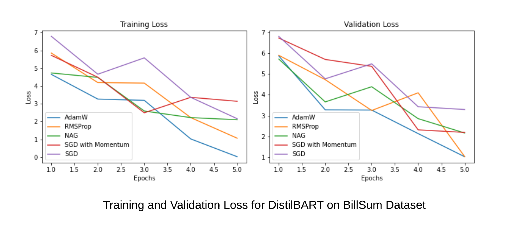

# Effect of Optimizer Selection and Hyperparameter Tuning on Training Efficiency and LLM Performance

- A Comparative analysis of hyperparameter tuning for three NLP tasks of Sentiment Analysis, Question Answering and Text Summarization. First, DistilBERT, BERT and FinBERT models were fine-tuned for Sentiment Analysis. Next, DistilBERT, BERT and RoBERTa models were fine-tuned for Question Answering. Finally, DistilBART, T5 and BART models were fine-tuned for Text Summarization.

- We fine-tuned DistilBERT, BERT, and FinBERT models for Sentiment Analysis on the StockTwits and Financial PhraseBank dataset, while DistilBERT, BERT, RoBERTa were fine-tuned for Question Answering on the CoQA and SQuAD dataset. For Text Summarization, BART, DistillBART, and T5 models were fine-tuned on the BillSum and Multi-News dataset.

- The difference between optimizers is entirely captured by the choice of update rule and hyperparameters. As a hyperparameter tuning protocol approaches optimality, a more expressive optimizer can never underperform any of its specializations.

- In our experiments, we chose the search space for each optimizer by running an initial set of experiments over a relatively large search space. In a typical case, we ran a single set of initial trials per optimizer to select the final search space.

- Inclusion relationships between optimizers are very important in practice. More general optimizers never underperform their special cases. In particular, RMSProp and AdamW never underperformed SGD, Nesterov, or Momentum optimizers.

- The difference between optimizers is entirely captured by the choice of update rule and hyperparameters. As a hyperparameter tuning protocol approaches optimality, a more expressive optimizer can never underperform any of its specializations. This can be shown by the inclusion relations between the optimizers as follows:

  - SGD ⊆ MOMENTUM ⊆ RMSPROP
  - SGD ⊆ MOMENTUM ⊆ ADAM
  - SGD ⊆ NESTEROV ⊆ NADAM

## Parameters used in Hyperparameter Tuning

- The **Learning Rate (η)** controls how much to change the model in response to the estimated error each time the model weights are updated. Choosing the learning rate is challenging since a value too small may result in a long training process that could get stuck, whereas a value too large may result in learning a sub-optimal set of weights too quickly or an unstable training process.

- The **Momentum** (γ) allows the gradient search to build inertia in a direction in the search space, and overcome the oscillations of noisy gradients and converge to the local maxima/minima faster. Momentum has the effect of dampening down the change in the gradient and the step size with each new point in the search space.

- The **Smoothing Constant (α)** maintains a decaying average of squared gradients. Using a decaying moving average of the partial derivative allows the search to forget early partial derivative values and focus on the most recently seen shape of the search space.

- **The Exponential Decay Rate Moment Estimates (β1 and β2)** are used for smoothing the path to convergence, and for also providing some momentum to cross a local minima or saddle point.

## Data

### Financial Phrase Bank  

The Financial PhraseBank dataset consists of 4840 sentences from English language financial news categorised by sentiment.
These sentences then were annotated by 16 people with background in finance and business.

The dataset contains two columns  

- **Sentiment**: The sentiment can be negative, neutral or positive.
- **News Headline**: Headlines of the news articles. Predicting the sentiment based on the news headlines.

### StockTwits

The Stocktwits dataset consists of 64,51,067 StockTwits from the [StockTwits](https://stocktwits.com/) platform and each post has been categorised by a polarity.

The dataset contains two columns:  

- **Text**: The text contained in the StockTwit post. The text refers to information about the performance of a stock.

- **Polarity**: Contains two values ie. Negative and Positive. Negative indicates that the Stock price may from fall whereas Positive indicates an increase in price of the Stock.
   

### FINGPT-Sentiment

The FinGPT-Sentiment dataset is created by combining the Financial Phrase Bank, FIQA-sentiment, twitter-financial-news-sentiment and news-with-gpt-instructions datasets. The dataset contains the following instructions along with the sentiment scores: "What is the sentiment of this news? Please choose an answer from (strong negative/moderately/neutral)". The FinGPT-sentiment-train dataset contains 76.8K rows of training data.

The dataset consists of:

- **Input:** The text contained in the Headline of the news articles.

- **Instruction:** This column provides specific instructions or prompts that guide the sentiment analysis task. The instructions instruct the model to evaluate the sentiment of the text in the input column and specify the possible sentiment categories to choose from.

- **Output:** Contains sentiment labels which can be positive, negative, neutral, and fine-grained categories such as mildly positive, mildly negative, moderately positive, and moderately negative.

### FIQA

The FIQA (Financial Opinion Mining and Question Answering) dataset has a corpus, queries and qrels (relevance judgments file). The FiQA dataset has roughly 6,000 questions and 57,000 answers. They are in the following format:
The FIQA dataset contains:

- Corpus file: a .jsonl file (jsonlines) that contains a list of dictionaries, each with three fields \_id with unique document identifier, title with document title (optional) and text with document paragraph or passage.
- Queries file: a .jsonl file (jsonlines) that contains a list of dictionaries, each with two fields \_id with unique query identifier and text with query text.
- Qrels file: a .tsv file (tab-seperated) that contains three columns, i.e. the query-id, corpus-id and score in this order.

### Conversation QA Dataset (CoQA)

CoQA is a large-scale dataset for building Conversational Question Answering systems. The goal of the CoQA challenge is to measure the ability of machines to understand a text passage and answer a series of interconnected questions that appear in a conversation.

CoQA contains 127,000+ questions with answers collected from 8000+ conversations. Each conversation is collected by pairing two crowdworkers to chat about a passage in the form of questions and answers.
The dataset consists of:

- Text: The Title for each question and answer pair

- Question: The question regarding the context.

- Answer: The answer to each question.

### SQuAD

The Stanford Question Answering Dataset (**SQuAD**) is a reading comprehension dataset consisting of questions posed by crowdworkers on a set of Wikipedia articles. The answer to every question is a segment of text, or span, from the corresponding reading passage. There are 100,000+ question-answer pairs on 500+ articles.

The dataset contains the columns:

- Title: The Title for each question and answer pair.

- Context: The context of the news article.

- Question: The question regarding the context.

- Answers: The answer to each question.

### BillSum

BillSum is the first dataset for summarization of US Congressional and California state bills.

The BillSum dataset consists of three parts: US training bills, US test bills and California test bills. The US bills were collected from the Govinfo service provided by the United States Government Publishing Office (GPO). The corpus consists of bills from the 103rd-115th (1993-2018) sessions of Congress. The data was split into 18,949 train bills and 3,269 test bills. For California, bills from the 2015-2016 session were scraped directly from the legislature’s website; the summaries were written by their Legislative Counsel.
The dataset consists of:

- Text: Text present in the congressional or state bills.

- Summary: Summary of the Bills.

### Multi News

Multi-News, consists of news articles and human-written summaries of these articles from the site newser.com. Each summary is professionally written by editors and includes links to the original articles cited.

There are two features:

- document: Text of News Articles
- summary: News Summary.

## Experiments

### Financial Phrase-Bank

- The FINBERT model was fine tuned on the data. Training the model with an **Adam optimizer** with learning rate of 5e-5, for **3 epochs** yielded an **Accuracy of 90.91% and an F1 Score of 0.91.**

| Model      | Epochs | Accuracy | F1 Score(Weighted) |
| ---------- | ------ | -------- | ------------------ |
| FinBERT    | 3      | 90.9%    | 0.91               |
| BERT       | 3      | 86%      | 0.86               |
| DistilBERT | 3      | 82%      | 0.81               |

Hyperparameters used:

| Optimizer     | Learning Rate $\gamma$ | Momentum $\eta$ | Alpha $\alpha$ | Beta1 $\beta_1$ | Beta2 $\beta_2$ | Epsilon $\epsilon$ |
| ------------- | ---------------------- | --------------- | -------------- | --------------- | --------------- | ------------------ |
| AdamW         | 5e-5                   | 0.01            | 0.9            | 0.9             | 0.999           | 1e-5               |
| RMSprop       | 0.01                   | 0.01            | 0.99           | -               | -               | 1e-5               |
| NAG           | 5e-5                   | -               | -              | -               | -               | -                  |
| SGD(Momentum) | 5e-5                   | 0.001           | -              | -               | -               | -                  |
| SGD           | 0.01                   | -               | -              | -               | -               | -                  |

**Comparing the Training and Validation loss of all optimizers** for the fine tuned FinBERT model
 

## StockTwits

- For the **StockTwits** dataset, the best results were obtained using a fine-tuned **FinBERT** model. The model was trained using the **Adam** optimizer with learning rate of 5e-5, for **6 epochs** yielding an **Accuracy of 82%** and an **F1-Score of 0.68**.

| Model      | Accuracy | F1 Score(Weighted) |
| ---------- | -------- | ------------------ |
| RoBERTa    | 0.67     | 0.46               |
| DistilBERT | 0.74     | 0.52               |
| FinBERT    | 0.82     | 0.68               |

## Optimizers Comparison

The comparison of the optimizer hyperparamerters that were taken are shown below:

| Optimizer     | $\gamma$ (Learning Rate) | $\eta$ Momentum | $\alpha$ Alpha | $\beta_1$ Beta1 | $\beta_2$ Beta2 | $\epsilon$ Epsilon |
| ------------- | ------------------------ | --------------- | -------------- | --------------- | --------------- | ------------------ |
| AdamW         | 3e-5                     | 0.01            | 0.99           | 0.9             | 0.999           | 1e-5               |
| RMSprop       | 0.01                     | 0.01            | 0.99           | -               | -               | -                  |
| Adagrad       | 3e-5                     |                 | -              | -               | -               | -                  |
| SGD(Momentum) | 3e-5                     | 0.001           | -              | -               | -               | -                  |
| SGD           | 0.01                     |                 | -              | -               | -               | -                  |

**Comparing the Training and Validation loss of all optimizers** for the fine tuned FinBERT model
  

## FINGPT-Sentiment

- The LLama 3 model was fine tuned on the data. Training the model with an **Adam optimizer** with learning rate of 3e-5, for **6 epochs** yielded an **Accuracy of 84% and an F1 Score of 0.68.**

**Hyperparameter Tuning**

| Model       | Accuracy | F1 Score(Weighted) |
| ----------  | -------- | ------------------ |
| LLama 3     | 0.84     | 0.68               |
| Phi 3       | 0.74     | 0.59               |

## Optimizers Comparison

The comparison of the optimizer hyperparamerters that were taken are shown below:

| Optimizer        | $\gamma$ (Learning Rate) | $\eta$ Momentum  |$\alpha$ Alpha | $\beta_1$ Beta1 | $\beta_2$ Beta2 | $\epsilon$ Epsilon |
|------------------|-------------------|--------------|-----------|------------|------------|-------------|
| SGD              | 0.01              | -            | -         | -          | -          | -           |
| SGD (Momentum)   | 1e-2              | 1e-3         | -         | -          | -          | -           |
| NAG              | 1e-3              | 1e-3         | -         | -          | -          | -           |
| RMSProp          | 2e-5              | 1e-1         | 0.99      | -          | -          | 1e-5        |
| AdamW            | 3e-5              | 1e-1         | -         | 0.99       | 0.99       | 1e-5        |

**Comparing the Training and Validation loss of all optimizers** for the fine tuned LLama-3 model

## FIQA

- Training the model with an AdamW optimizer with learning rate of 3e-5 for 6 epochs on the Llama-3 model, yielded an **F1 Score of 0.86**.

**Hyperparameter Tuning**

| Model      | F1 Score(Weighted) |
| ---------- | ------------------ |
| LLama 3    | 0.86               |
| Phi 3      | 0.75               |

## Optimizers Comparison

The comparison of the optimizer hyperparamerters that were taken are shown below:

| Optimizer        | $\gamma$ (Learning Rate) | $\eta$ Momentum | $\alpha$ Alpha | $\beta_1$ Beta1 | $\beta_2$ Beta2 | $\epsilon$ Epsilon |
|------------------|-------------------|--------------|-----------|------------|------------|-------------|
| SGD              | 0.01              | -            | -         | -          | -          | -           |
| SGD (Momentum)   | 1e-2              | 1e-3         | -         | -          | -          | -           |
| NAG              | 1e-3              | 1e-3         | -         | -          | -          | -           |
| RMSProp          | 3e-5              | 1e-1         | 0.99      | -          | -          | 1e-5        |
| AdamW            | 2e-5              | 1e-1         | 0.99      | 0.99       | 0.99       | 1e-5        |

**Comparing the Training and Validation loss of all optimizers** for the fine tuned LLama-3 model

## COQA

- Training the model with an AdamW optimizer with learning rate of 5e-5 for 4 epochs on the DistilBERT model, yielded an **F1 Score of 0.68**.

**Hyperparameter Tuning**

| Model      | F1 Score(Weighted) |
| ---------- | ------------------ |
| DistilBERT | 0.68               |
| BERT       | 0.72               |
| RoBERTa    | 0.84               |

## Optimizers Comparison

The comparison of the optimizer hyperparamerters that were taken are shown below:

| Optimizer        | $\gamma$ (Learning Rate) | $\eta$ Momentum | $\alpha$ Alpha |$\beta_1$ Beta1 | $\beta_2$ Beta2 | $\epsilon$ Epsilon |
|------------------|-------------------|--------------|-----------|------------|------------|-------------|
| SGD              | 0.01              | -            | -         | -          | -          | -           |
| SGD (Momentum)   | 1e-2              | 1e-3         | -         | -          | -          | -           |
| NAG              | 1e-3              | 1e-3         | -         | -          | -          | -           |
| RMSProp          | 2e-5              | 1e-1         | 1-1e-2    | -          | -          | 1e-5        |
| AdamW            | 3e-5              | 1e-1         | 1-1e-2    | 1-1e-2     | 1-1e-2     | 1e-5        |

**Comparing the Training and Validation loss of all optimizers** for the fine tuned RoBERTa model

## SQUAD

- The RoBERTa model was fine tuned on the data. Training the model with an **Adam optimizer** with learning rate of **5e-5**, for **6 epochs** yielded an **Exact Match(EM)** of 72% and an **F1 Score** of **74**.

**Hyperparameter Tuning**

| Model      | Epochs | Exact Match(EM) | F1 Score(Weighted) |
| ---------- | ------ | --------------- | ------------------ |
| BERT       | 6      | 68              | 64                 |
| DistilBERT | 6      | 70              | 62                 |
| RoBERTa    | 6      | 72              | 74                 |

## Optimizers Comparison

The table lists out the different optimizers and their parameters used in training.

| Optimizer     | Learning Rate $\gamma$ | Momentum $\eta$ | Alpha $\alpha$ | Beta1 $\beta_1$ | Beta2 $\beta_2$ | Epsilon $\epsilon$ |
| ------------- | ---------------------- | --------------- | -------------- | --------------- | --------------- | ------------------ |
| AdamW         | 5e-5                   | 0.01            | 0.9            | 0.9             | 0.999           | 1e-5               |
| RMSprop       | 0.01                   | 0.01            | 0.99           | -               | -               | 1e-5               |
| NAG           | 5e-5                   |                 | 0.01           | -               | -               | -                  |
| SGD(Momentum) | 5e-5                   | 0.001           | -              | -               | -               | 1e-5               |
| SGD           | 0.01                   |                 |                |                 |                 |                    |

**Comparing the Training and Validation loss of all optimizers** for the fine tuned RoBERTa model
 

## BillSum

**Hyperparameter Tuning**

- The DistilBART model was fine tuned on the data. Training the model with an **Adam optimizer** with learning rate of **3e-5**, for **6 epochs** yielded an **EROUGUE-L** of 25.

| Model      | ROUGE-1 | ROUGUE-2 | ROUGUE-L |
| ---------- | ------- | -------- | -------- |
| T5         | 38      | 12       | 22       |
| DistilBART | 40      | 17       | 25       |

## Optimizers Comparison

The table lists out the different optimizers and their parameters used in training.

| Optimizer | (Learning Rate) | (Momentum) | (Alpha) | (Betal) | (Beta2) | (Epsilon) |
|---|---|---|---|---|---|---|
| SGD | 0.01 | - | - | - | - | - |
| SGD(Momentum) |  -| 1e-2 | 1e-3 | - | - | - |
| NAG | 1e-3 | 1e-3 | - | - | - | - |
| RMSProp | 2e-5 | 1e-1 | 1-1e-2 | 1e-5 | - |
| AdamW | 3e-5 | 1e-1 | 1-1e-2 | 1-1e-2 | 1e-5 |

**Comparing the Training and Validation loss of all optimizers** for the fine tuned DistilBART model

The rate of convergence of the AdamW optimizer is the fastest.

## Multi News

**Hyperparameter Tuning**

The DistilBART model for text summarization was trained with **Adam optimizer** having learning rate **2e-5** for **6 epochs** yielded a ROUGUE-L score of 42 and F1(weighted) of 0.86.

| Model      | Epochs | ROUGUE-L | F1 Score(Weighted) |
| ---------- | ------ | -------- | ------------------ |
| BART       | 6      | 38       | 0.84               |
| DistilBART | 6      | 42       | 0.86               |

## Optimizers Comparison

The table lists out the different optimizers and their parameters used in training.
| Optimizer     | Learning Rate $\gamma$ | Momentum $\eta$ | Alpha $\alpha$ | Beta1 $\beta_1$ | Beta2 $\beta_2$ | Epsilon $\epsilon$ |
| ------------- | ---------------------- | --------------- | -------------- | --------------- | --------------- | ------------------ |
| AdamW         | 5e-5                   | 0.01            | 0.9            | 0.9             | 0.999           | 1e-5               |
| RMSprop       | 0.01                   | 0.01            | 0.99           | -               | -               | -                  |
| NAG           | 5e-5                   |                 | -              | -               | -               | -                  |
| SGD(Momentum) | 5e-5                   | 0.001           | -              | -               | -               | -                  |
| SGD           | 0.01                   |                 | -              | -               | -               | -                  |

**Comparing the Training and Validation loss of all optimizers** for the fine tuned DistilBART model
 

# GPT-3 Training

- To train the GPT-3 model, the Adam optimizer was used with $\beta_1 = 0.9$ and $\beta_2 = 0.95$, and $\epsilon = 10^{-8}$. The global norm of the gradient was clipped at 1.0. A cosine decay for the learning rate down to 10\% of its value, over 260 billion tokens (after 260 billion tokens, training continues at 10\% of the original learning rate) was used. Then a linear learning rate warmup used over the first 375 million tokens.

- The batch size is gradually increased from a small value (32k tokens) to the full value over the first 4-12 billion tokens of training. Data was sampled without replacement during training (until an epoch boundary is reached) to minimize overfitting. All models use weight decay of 0.1 to provide a small amount of regularization.

- During training the model is trained on sequences of the full nctx = 2048 token context window, packing multiple documents into a single sequence when documents are shorter than 2048, in order to increase computational efficiency.

- Mixed precision training is employed to reduce memory usage and speed up training, using both 16-bit and 32-bit floating-point types. Gradient accumulation is used to effectively increase the batch size by accumulating gradients over multiple smaller batches before performing weight updates.

- Sequences with multiple documents are not masked in any special way but instead documents within a sequence are delimited with a special end of text token, giving the language model the information necessary to infer that context separated by the end of text token is unrelated. This allows for efficient training without need for any special
sequence-specific masking.
